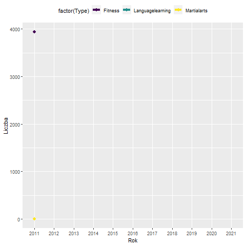

```{r source, include=FALSE, cache=TRUE}
source("Funkcje_1.R")
source("Funkcje_2.R")
```

# Opis projektu

Poniższa praca ma na celu odpowiedź na trzy postawione przez nas pytania badawcze. Dane, które wybraliśmy, aby na nie odpowiedzieć, pochodzą z portali: Fitness, Gaming, Languagelearning oraz Matrialarts. Wszystkie z nich udostępniane są przez sieć Stack Exchange.

# Problem 1

### Opis

Pierwsze z pytań brzmi: Co wpływa na sukces użytkownika na forum? Odpowiedzi szukaliśmy na przykładzie forum Gaming. Przez "sukces" rozumiemy zarówno wysoką ocenę jego postów, jak i ich popularność. 

### Definicja "sukcesu"

Zauważmy, że dla każdego posta wyznaczyć można parametr będący iloczynem jego oceny (Score) i liczby wyświetleń (ViewCount). Taki parametr nazywamy "sukcesem". Jeden użytkownik może jednak być autorem wielu postów. Wprowadzamy więc dwa dodatkowe parametry. Pierwszy z nich to "sukces absolutny" będący sumą "sukcesu" wszystkich postów danego użytkownika, drugi zaś to "sukces średni" będący średnią arytmetyczną "sukcesu" wszystkich postów. Dodatkowo, ze względu na swój absolutny i średni sukces, użytkownicy zostali podzieleni na pięć grup, od najgorszej do najlepszej: "Unsuccessful", "Normal", "Successful", "Brilliant" i "Elite". Chcąc dowiedzieć się, co wpływa na sukces użytkowników, badamy więc cechy wspólne, którymi charakteryzują się osoby zaklasyfikowane do danej grupy.

### Model 1

Czynnikiem, który może pozytywnie wpływać na sukces użytkowników, jest czas użytkowania konta. Im dłużej ktoś korzysta z forum, tym więcej ma doświadczenia i tym lepsze powinny być jego posty. Czy tak rzeczywiście jest? Co wykazała analiza?

```{r wykresy 1, echo=FALSE}
plot(1:5, Lista_suc_abs, axes = FALSE,
     type = "l", xlab = NA, ylab = "Czas w latach")
title("Czas użytkowania konta a sukces absolutny")
axis(1, at = 1:5, labels = names(Lista_con_abs), xpd = TRUE, pos = 0)
axis(2, at = 0:5, las = 1, xpd = TRUE)

plot(1:5, Lista_suc_avg, axes = FALSE,
     type = "l", xlab = NA, ylab = "Czas w latach")
title("Czas użytkowania konta a sukces uśredniony")
axis(1, at = 1:5, labels = names(Lista_con_avg), xpd = TRUE, pos = 0)
axis(2, at = 0:5, las = 1, xpd = TRUE)
```

Powyższe wykresy potwierdzają nasze początkowe przypuszczenia. Doświadczenie rzeczywiście wpływa pozytywnie na sukces postów danego użytkownika.

### Model 2

Innym czynnikiem, który może pozytywnie wpływać na popularność postów, jest ich kontrowersyjność. Przez "kontrowersyjność" rozumiemy średni stosunek głosów negatywnych do wszystkich głosów oddanych na posty danego użytkownika. Czy budzenie w innych negatywnych emocji wpływa na sukces?

```{r wykresy 2, echo=FALSE}
plot(1:5, Lista_con_abs, type = "l", xlab = NA, ylab = "Kontrowersyjność", frame.plot = FALSE, axes = FALSE)
title("Kontrowersyjność a sukces absolutny")
axis(1, at = 1:5, labels = names(Lista_con_abs))
axis(2, at = seq(0, 0.07, 0.01), las = 1)

plot(1:5, Lista_con_avg, type = "l", xlab = NA, ylab = "Kontrowersyjność", frame.plot = FALSE, axes = FALSE)
title("Kontrowersyjność a sukces uśredniony")
axis(1, at = 1:5, labels = names(Lista_con_avg))
axis(2, at = seq(0, 0.06, 0.01), las = 1)
```

Powyższe wykresy pokazują, że kontrowersyjność również wpływa na sukces użytkowników. Jej efekty jednak widoczne są dopiero w bardziej zaawansowanych grupach.

# Problem 2

## Opis

Jakie zainteresowania mają użytkownicy forum Gaming? Sprawdziliśmy to na przykładzie forów Fitness, Languagelearning oraz Martialarts. Poniższy wykres przedstawia rozkład tych zainteresowań.

```{r wykresy 3, echo=FALSE}
piepercent<- round(100*dane[ ,1]/sum(dane[ ,1]), 1)

pie(dane[ ,1], labels = piepercent, main = "Zainteresowania użytkowników forum Gaming",
         col = rainbow(length(dane[ ,1])), radius = 0.7,
        cex = 0.6)
par(mar= c(0.9, 0.9, 0.9, 0.9))
legend(.9, .1, dane[ , 2], cex = 0.7,
       fill = rainbow(length(dane[ ,1])))
```

Widzimy więc, że znaczna większość użytkowników forum Gaming udziela się również na forum Fitness. 

# Problem 3

## Opis

Jak dużo postów pisanych było na forach w ostatnich latach? Sprawdziliśmy to na przykładzie forów Fitness, Languagelearning oraz Martialarts.

Poniżej znajduje się animowany wykres przedstawiający zależność liczby postów pisanych na każdym forum od roku (wartość 0 oznacza, że forum nie było dostępne w danym roku).



Z wykresu wynika, że najpopularniejsze jest forum Fitness. Dodatkowo możemy stwierdzić, że w ostatnich latach widać spadek liczby postów niezależnie od forum, stały się one więc znacznie mniej popularne.

# Podsumowanie


## R Markdown

This is an R Markdown document. Markdown is a simple formatting syntax for authoring HTML, PDF, and MS Word documents. For more details on using R Markdown see <http://rmarkdown.rstudio.com>.

When you click the **Knit** button a document will be generated that includes both content as well as the output of any embedded R code chunks within the document. You can embed an R code chunk like this:

```{r cars}
summary(cars)
```

## Including Plots

You can also embed plots, for example:

```{r pressure, echo=FALSE}
plot(pressure)
```

Note that the `echo = FALSE` parameter was added to the code chunk to prevent printing of the R code that generated the plot.
